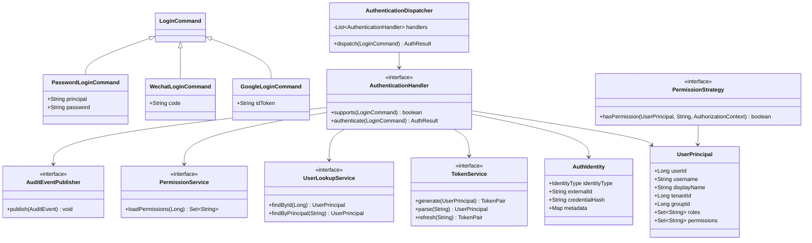
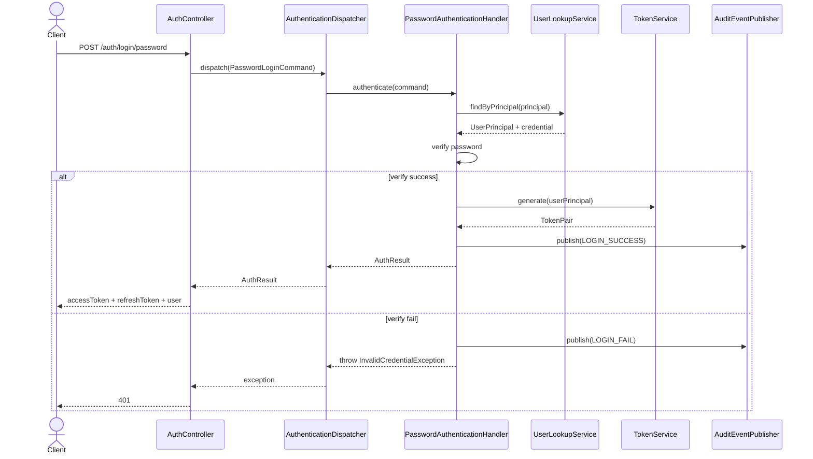
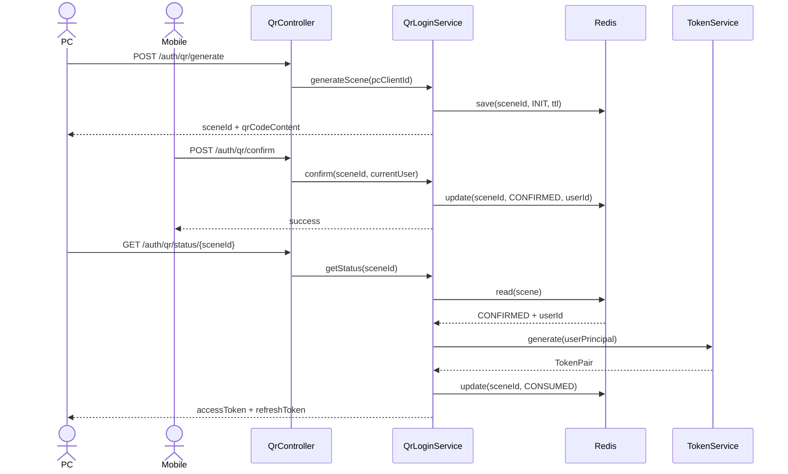

# 通用身份认证与权限管理 Starter 开发开端文档

> 版本：v0.1  
> 目标：作为首版开发启动文档，覆盖数据库 DDL、接口文档、模块目录、Gradle Kotlin DSL、核心类图与时序图、首版代码骨架。  
> 技术基线：Java 25、Kotlin 2.1、Spring Boot 3.x、Spring Security 6.x、Gradle Kotlin DSL。  

---

## 1. 文档目标与范围

本文档用于指导一个可插拔的 **认证与权限管理 Spring Boot Starter** 的首版落地开发，覆盖以下 5 项交付物：

1. 完整数据库 DDL
2. 完整接口文档（OpenAPI 风格）
3. Starter 模块目录 + Gradle Kotlin DSL 示例
4. 核心类图与时序图
5. 首版可落地代码骨架

本文档默认支持以下能力：

- 账号密码登录
- 微信登录
- Google 登录
- PC 扫码登录
- 用户自主注册
- 基础 / 组别 / 公司（多租户）三种组织模式
- 菜单 / 按钮 / API 权限控制
- 登录日志 / 安全事件 / 锁定策略
- JWT 无状态认证
- Spring Boot Starter 自动装配
- Java 25 虚拟线程优化并发认证流程

---

## 2. 总体设计原则

### 2.1 设计原则

- **零侵入**：业务工程仅需引入 starter 并配置 `application.yml`
- **可插拔**：通过 SPI + Conditional 自动装配扩展认证源、授权策略、审计逻辑
- **领域解耦**：认证、授权、组织、租户、审计分层
- **可演进**：为短信登录、企业微信、钉钉、OAuth2 Client、数据权限预留扩展点
- **多模式兼容**：支持 BASIC / GROUP / TENANT 三种组织模式

### 2.2 模块边界

- **认证域**：用户身份识别与令牌签发
- **授权域**：角色、权限、资源准入控制
- **组织域**：部门 / 小组树、权限继承
- **租户域**：多租户隔离上下文
- **审计域**：登录日志、安全事件、访问拒绝记录

---

## 3. 数据库 DDL

> 说明：以下以 MySQL 8 为例；如需 PostgreSQL，可替换 `json`、索引与时间函数写法。  
> 命名约定：
> - 主键统一 `bigint`
> - 状态位统一 `tinyint`
> - 时间统一 `datetime(3)`
> - 逻辑删除统一 `deleted`

---

### 3.1 用户主表 `sys_user`

```sql
create table if not exists sys_user (
    id bigint not null auto_increment comment '主键',
    username varchar(64) not null comment '用户名',
    nickname varchar(128) null comment '昵称',
    display_name varchar(128) null comment '展示名',
    email varchar(128) null comment '邮箱',
    mobile varchar(32) null comment '手机号',
    avatar_url varchar(512) null comment '头像',
    status tinyint not null default 1 comment '状态: 1启用 0禁用',
    group_id bigint null comment '所属组/部门ID',
    tenant_id bigint null comment '所属租户ID',
    register_source varchar(32) null comment '注册来源',
    password_version int not null default 1 comment '密码版本，用于旧token失效控制',
    last_login_at datetime(3) null comment '最后登录时间',
    locked_until datetime(3) null comment '锁定截止时间',
    deleted tinyint not null default 0 comment '逻辑删除',
    created_at datetime(3) not null default current_timestamp(3) comment '创建时间',
    updated_at datetime(3) not null default current_timestamp(3) on update current_timestamp(3) comment '更新时间',
    primary key (id),
    unique key uk_sys_user_username (username),
    unique key uk_sys_user_email (email),
    unique key uk_sys_user_mobile (mobile),
    key idx_sys_user_group_id (group_id),
    key idx_sys_user_tenant_id (tenant_id),
    key idx_sys_user_status (status, deleted)
) engine=InnoDB default charset=utf8mb4 comment='用户主表';
```

---

### 3.2 身份源绑定表 `sys_auth`

```sql
create table if not exists sys_auth (
    id bigint not null auto_increment comment '主键',
    user_id bigint not null comment '用户ID',
    identity_type varchar(32) not null comment '身份源类型: PASSWORD/WECHAT/GOOGLE',
    principal_key varchar(191) not null comment '唯一标识，例如用户名/邮箱/openId/sub',
    credential_hash varchar(255) null comment '密码哈希',
    credential_salt varchar(255) null comment '密码盐，可选',
    external_union_id varchar(191) null comment '微信unionId',
    external_open_id varchar(191) null comment '微信openId',
    metadata_json json null comment '身份扩展信息',
    enabled tinyint not null default 1 comment '是否启用',
    created_at datetime(3) not null default current_timestamp(3),
    updated_at datetime(3) not null default current_timestamp(3) on update current_timestamp(3),
    primary key (id),
    unique key uk_sys_auth_identity_principal (identity_type, principal_key),
    key idx_sys_auth_user_id (user_id),
    key idx_sys_auth_union_id (external_union_id),
    key idx_sys_auth_open_id (external_open_id),
    constraint fk_sys_auth_user_id foreign key (user_id) references sys_user(id)
) engine=InnoDB default charset=utf8mb4 comment='身份源绑定表';
```

---

### 3.3 组织架构表 `sys_group`

```sql
create table if not exists sys_group (
    id bigint not null auto_increment,
    tenant_id bigint null comment '租户ID',
    group_name varchar(128) not null comment '组/部门名称',
    group_code varchar(64) not null comment '组/部门编码',
    parent_id bigint null comment '父组ID',
    ancestors varchar(1024) not null default '0' comment '祖先路径，例如 0,1,5',
    level int not null default 1 comment '层级深度',
    sort_no int not null default 0 comment '排序号',
    enabled tinyint not null default 1,
    created_at datetime(3) not null default current_timestamp(3),
    updated_at datetime(3) not null default current_timestamp(3) on update current_timestamp(3),
    primary key (id),
    unique key uk_sys_group_tenant_code (tenant_id, group_code),
    key idx_sys_group_parent_id (parent_id),
    key idx_sys_group_tenant_id (tenant_id),
    key idx_sys_group_ancestors (ancestors(255))
) engine=InnoDB default charset=utf8mb4 comment='组织架构表';
```

---

### 3.4 角色表 `sys_role`

```sql
create table if not exists sys_role (
    id bigint not null auto_increment,
    tenant_id bigint null comment '租户ID',
    role_code varchar(64) not null comment '角色编码',
    role_name varchar(128) not null comment '角色名称',
    data_scope varchar(32) not null default 'SELF' comment 'SELF/GROUP/GROUP_AND_CHILDREN/TENANT/ALL',
    enabled tinyint not null default 1,
    created_at datetime(3) not null default current_timestamp(3),
    updated_at datetime(3) not null default current_timestamp(3) on update current_timestamp(3),
    primary key (id),
    unique key uk_sys_role_tenant_code (tenant_id, role_code),
    key idx_sys_role_enabled (enabled)
) engine=InnoDB default charset=utf8mb4 comment='角色表';
```

---

### 3.5 权限表 `sys_permission`

```sql
create table if not exists sys_permission (
    id bigint not null auto_increment,
    tenant_id bigint null comment '租户ID',
    permission_code varchar(128) not null comment '权限编码',
    permission_name varchar(128) not null comment '权限名称',
    permission_type varchar(32) not null comment 'MENU/BUTTON/API',
    parent_id bigint null comment '父权限ID',
    path varchar(255) null comment '前端路由路径',
    http_method varchar(16) null comment 'HTTP方法',
    resource_pattern varchar(255) null comment '资源匹配表达式',
    enabled tinyint not null default 1,
    created_at datetime(3) not null default current_timestamp(3),
    updated_at datetime(3) not null default current_timestamp(3) on update current_timestamp(3),
    primary key (id),
    unique key uk_sys_perm_tenant_code (tenant_id, permission_code),
    key idx_sys_perm_type (permission_type),
    key idx_sys_perm_parent_id (parent_id)
) engine=InnoDB default charset=utf8mb4 comment='权限表';
```

---

### 3.6 用户角色关系表 `sys_user_role`

```sql
create table if not exists sys_user_role (
    id bigint not null auto_increment,
    user_id bigint not null,
    role_id bigint not null,
    created_at datetime(3) not null default current_timestamp(3),
    primary key (id),
    unique key uk_sys_user_role (user_id, role_id),
    key idx_sys_user_role_role_id (role_id),
    constraint fk_sys_user_role_user_id foreign key (user_id) references sys_user(id),
    constraint fk_sys_user_role_role_id foreign key (role_id) references sys_role(id)
) engine=InnoDB default charset=utf8mb4 comment='用户角色关系表';
```

---

### 3.7 组角色关系表 `sys_group_role`

```sql
create table if not exists sys_group_role (
    id bigint not null auto_increment,
    group_id bigint not null,
    role_id bigint not null,
    created_at datetime(3) not null default current_timestamp(3),
    primary key (id),
    unique key uk_sys_group_role (group_id, role_id),
    key idx_sys_group_role_role_id (role_id)
) engine=InnoDB default charset=utf8mb4 comment='组角色关系表';
```

---

### 3.8 角色权限关系表 `sys_role_permission`

```sql
create table if not exists sys_role_permission (
    id bigint not null auto_increment,
    role_id bigint not null,
    permission_id bigint not null,
    created_at datetime(3) not null default current_timestamp(3),
    primary key (id),
    unique key uk_sys_role_permission (role_id, permission_id),
    key idx_sys_role_permission_permission_id (permission_id),
    constraint fk_sys_role_permission_role_id foreign key (role_id) references sys_role(id),
    constraint fk_sys_role_permission_permission_id foreign key (permission_id) references sys_permission(id)
) engine=InnoDB default charset=utf8mb4 comment='角色权限关系表';
```

---

### 3.9 租户表 `sys_tenant`

```sql
create table if not exists sys_tenant (
    id bigint not null auto_increment,
    tenant_code varchar(64) not null,
    tenant_name varchar(128) not null,
    status tinyint not null default 1,
    expires_at datetime(3) null,
    created_at datetime(3) not null default current_timestamp(3),
    updated_at datetime(3) not null default current_timestamp(3) on update current_timestamp(3),
    primary key (id),
    unique key uk_sys_tenant_code (tenant_code)
) engine=InnoDB default charset=utf8mb4 comment='租户表';
```

---

### 3.10 二维码登录场景表 `sys_qr_scene`（可选，推荐 Redis 优先）

> 若纯缓存实现可不建表；若要求审计追踪，可建此表做落库留痕。

```sql
create table if not exists sys_qr_scene (
    id bigint not null auto_increment,
    scene_id varchar(64) not null comment '二维码场景ID',
    pc_client_id varchar(128) null comment 'PC端客户端ID',
    status varchar(32) not null comment 'INIT/SCANNED/CONFIRMED/CANCELED/EXPIRED/CONSUMED',
    confirmed_user_id bigint null comment '确认用户ID',
    expire_at datetime(3) not null,
    created_at datetime(3) not null default current_timestamp(3),
    updated_at datetime(3) not null default current_timestamp(3) on update current_timestamp(3),
    primary key (id),
    unique key uk_sys_qr_scene_scene_id (scene_id),
    key idx_sys_qr_scene_status (status),
    key idx_sys_qr_scene_expire_at (expire_at)
) engine=InnoDB default charset=utf8mb4 comment='二维码登录场景表';
```

---

### 3.11 登录日志表 `sys_login_log`

```sql
create table if not exists sys_login_log (
    id bigint not null auto_increment,
    user_id bigint null,
    principal varchar(191) null comment '登录标识',
    login_type varchar(32) not null comment 'PASSWORD/WECHAT/GOOGLE/QR',
    result varchar(32) not null comment 'SUCCESS/FAIL',
    ip varchar(64) null,
    user_agent varchar(512) null,
    location varchar(255) null,
    reason varchar(255) null comment '失败原因',
    created_at datetime(3) not null default current_timestamp(3),
    primary key (id),
    key idx_sys_login_log_user_id (user_id),
    key idx_sys_login_log_result (result),
    key idx_sys_login_log_created_at (created_at)
) engine=InnoDB default charset=utf8mb4 comment='登录日志表';
```

---

### 3.12 安全事件表 `sys_security_event`

```sql
create table if not exists sys_security_event (
    id bigint not null auto_increment,
    event_type varchar(64) not null comment 'LOGIN_FAIL/ACCESS_DENIED/ACCOUNT_LOCKED/PASSWORD_RESET/QR_CONFIRMED',
    user_id bigint null,
    tenant_id bigint null,
    detail_json json null,
    ip varchar(64) null,
    created_at datetime(3) not null default current_timestamp(3),
    primary key (id),
    key idx_sys_security_event_type (event_type),
    key idx_sys_security_event_user_id (user_id),
    key idx_sys_security_event_created_at (created_at)
) engine=InnoDB default charset=utf8mb4 comment='安全事件表';
```

---

### 3.13 Token 黑名单表 `sys_token_blacklist`（可选）

```sql
create table if not exists sys_token_blacklist (
    id bigint not null auto_increment,
    jti varchar(128) not null,
    user_id bigint not null,
    expire_at datetime(3) not null,
    created_at datetime(3) not null default current_timestamp(3),
    primary key (id),
    unique key uk_sys_token_blacklist_jti (jti),
    key idx_sys_token_blacklist_expire_at (expire_at)
) engine=InnoDB default charset=utf8mb4 comment='JWT黑名单表';
```

---

## 4. 接口文档（OpenAPI 风格）

> 路径前缀统一 `/auth`  
> 返回结构统一：

```json
{
  "code": "0",
  "message": "OK",
  "data": {}
}
```

错误响应：

```json
{
  "code": "AUTH_401001",
  "message": "用户名或密码错误",
  "data": null
}
```

---

### 4.1 用户名密码登录

#### POST `/auth/login/password`

**Request**

```json
{
  "principal": "admin",
  "password": "P@ssw0rd!"
}
```

**Response**

```json
{
  "code": "0",
  "message": "OK",
  "data": {
    "accessToken": "jwt-access-token",
    "refreshToken": "jwt-refresh-token",
    "tokenType": "Bearer",
    "expiresIn": 1800,
    "user": {
      "userId": 1,
      "username": "admin",
      "displayName": "系统管理员",
      "tenantId": null,
      "groupId": 1,
      "roles": ["ADMIN"],
      "permissions": ["menu:system:user", "button:system:user:create"]
    }
  }
}
```

---

### 4.2 微信登录

#### POST `/auth/login/wechat`

**Request**

```json
{
  "code": "wechat-oauth-code"
}
```

**Response**

同密码登录。

---

### 4.3 Google 登录

#### POST `/auth/login/google`

**Request**

```json
{
  "idToken": "google-id-token"
}
```

**Response**

同密码登录。

---

### 4.4 用户注册

#### POST `/auth/register`

**Request**

```json
{
  "username": "new_user",
  "password": "P@ssw0rd!",
  "email": "new_user@example.com",
  "mobile": "13800138000",
  "displayName": "新用户"
}
```

**Response**

```json
{
  "code": "0",
  "message": "OK",
  "data": {
    "userId": 1001,
    "username": "new_user",
    "defaultRoles": ["USER"]
  }
}
```

---

### 4.5 刷新令牌

#### POST `/auth/token/refresh`

**Request**

```json
{
  "refreshToken": "jwt-refresh-token"
}
```

**Response**

```json
{
  "code": "0",
  "message": "OK",
  "data": {
    "accessToken": "new-access-token",
    "refreshToken": "new-refresh-token",
    "tokenType": "Bearer",
    "expiresIn": 1800
  }
}
```

---

### 4.6 登出

#### POST `/auth/logout`

**Request**

Header:

```http
Authorization: Bearer <accessToken>
```

**Response**

```json
{
  "code": "0",
  "message": "OK",
  "data": true
}
```

---

### 4.7 获取当前用户信息

#### GET `/auth/me`

**Response**

```json
{
  "code": "0",
  "message": "OK",
  "data": {
    "userId": 1,
    "username": "admin",
    "displayName": "系统管理员",
    "tenantId": null,
    "groupId": 1,
    "roles": ["ADMIN"],
    "permissions": ["menu:system:user", "button:system:user:create"]
  }
}
```

---

### 4.8 修改密码

#### POST `/auth/password/change`

**Request**

```json
{
  "oldPassword": "oldPass",
  "newPassword": "newPass"
}
```

**Response**

```json
{
  "code": "0",
  "message": "OK",
  "data": true
}
```

---

### 4.9 重置密码（管理员或找回流程接入点）

#### POST `/auth/password/reset`

**Request**

```json
{
  "principal": "admin",
  "newPassword": "Reset@123"
}
```

---

### 4.10 生成二维码

#### POST `/auth/qr/generate`

**Request**

```json
{
  "pcClientId": "browser-session-uuid"
}
```

**Response**

```json
{
  "code": "0",
  "message": "OK",
  "data": {
    "sceneId": "QR202603260001",
    "qrCodeContent": "auth://qr-login?sceneId=QR202603260001",
    "expireAt": "2026-03-26T11:30:00"
  }
}
```

---

### 4.11 查询二维码状态

#### GET `/auth/qr/status/{sceneId}`

**Response**

```json
{
  "code": "0",
  "message": "OK",
  "data": {
    "sceneId": "QR202603260001",
    "status": "SCANNED"
  }
}
```

状态枚举：

- `INIT`
- `SCANNED`
- `CONFIRMED`
- `CANCELED`
- `EXPIRED`
- `CONSUMED`

---

### 4.12 确认二维码登录

#### POST `/auth/qr/confirm`

**Request**

```json
{
  "sceneId": "QR202603260001",
  "confirm": true
}
```

**Response**

```json
{
  "code": "0",
  "message": "OK",
  "data": true
}
```

---

### 4.13 取消二维码登录

#### POST `/auth/qr/cancel`

**Request**

```json
{
  "sceneId": "QR202603260001"
}
```

---

### 4.14 查询登录日志

#### GET `/auth/login-logs?page=1&size=20`

---

### 4.15 查询安全事件

#### GET `/auth/security-events?page=1&size=20`

---

## 5. Starter 模块目录与 Gradle Kotlin DSL

## 5.1 推荐多模块目录

```text
auth-starter/
├── build.gradle.kts
├── settings.gradle.kts
├── gradle/
│
├── auth-core/
│   ├── build.gradle.kts
│   └── src/main/kotlin/com/company/auth/core/
│       ├── domain/
│       ├── enums/
│       ├── spi/
│       ├── strategy/
│       └── exception/
│
├── auth-security/
│   ├── build.gradle.kts
│   └── src/main/kotlin/com/company/auth/security/
│       ├── config/
│       ├── filter/
│       ├── token/
│       ├── handler/
│       ├── provider/
│       └── authorization/
│
├── auth-persistence/
│   ├── build.gradle.kts
│   └── src/main/kotlin/com/company/auth/persistence/
│       ├── entity/
│       ├── repository/
│       ├── mapper/
│       └── service/
│
├── auth-social-wechat/
│   ├── build.gradle.kts
│   └── src/main/kotlin/com/company/auth/social/wechat/
│
├── auth-social-google/
│   ├── build.gradle.kts
│   └── src/main/kotlin/com/company/auth/social/google/
│
├── auth-qr/
│   ├── build.gradle.kts
│   └── src/main/kotlin/com/company/auth/qr/
│
├── auth-audit/
│   ├── build.gradle.kts
│   └── src/main/kotlin/com/company/auth/audit/
│
├── auth-autoconfigure/
│   ├── build.gradle.kts
│   └── src/main/kotlin/com/company/auth/autoconfigure/
│
├── auth-spring-boot-starter/
│   └── build.gradle.kts
│
└── auth-demo/
    ├── build.gradle.kts
    └── src/main/resources/application.yml
```

---

## 5.2 根工程 `settings.gradle.kts`

```kotlin
rootProject.name = "auth-starter"

include(
    "auth-core",
    "auth-security",
    "auth-persistence",
    "auth-social-wechat",
    "auth-social-google",
    "auth-qr",
    "auth-audit",
    "auth-autoconfigure",
    "auth-spring-boot-starter",
    "auth-demo"
)
```

---

## 5.3 根工程 `build.gradle.kts`

```kotlin
plugins {
    kotlin("jvm") version "2.1.0" apply false
    kotlin("plugin.spring") version "2.1.0" apply false
    id("org.springframework.boot") version "3.4.0" apply false
    id("io.spring.dependency-management") version "1.1.6" apply false
}

allprojects {
    group = "com.company"
    version = "0.1.0-SNAPSHOT"

    repositories {
        mavenCentral()
    }
}

subprojects {
    apply(plugin = "org.jetbrains.kotlin.jvm")

    java {
        toolchain {
            languageVersion.set(JavaLanguageVersion.of(25))
        }
    }

    tasks.withType<org.jetbrains.kotlin.gradle.tasks.KotlinCompile>().configureEach {
        compilerOptions {
            freeCompilerArgs.add("-Xjsr305=strict")
            jvmTarget.set(org.jetbrains.kotlin.gradle.dsl.JvmTarget.JVM_25)
        }
    }

    dependencies {
        "implementation"(kotlin("stdlib"))
        "testImplementation"("org.junit.jupiter:junit-jupiter:5.11.3")
    }

    tasks.withType<Test>().configureEach {
        useJUnitPlatform()
    }
}
```

---

## 5.4 `auth-core/build.gradle.kts`

```kotlin
plugins {
    kotlin("jvm")
}

dependencies {
    api("org.slf4j:slf4j-api:2.0.16")
}
```

---

## 5.5 `auth-security/build.gradle.kts`

```kotlin
plugins {
    kotlin("jvm")
    kotlin("plugin.spring")
    id("io.spring.dependency-management")
}

dependencies {
    implementation(project(":auth-core"))
    implementation("org.springframework.boot:spring-boot-starter-security:3.4.0")
    implementation("org.springframework.boot:spring-boot-starter-web:3.4.0")
    implementation("org.springframework.boot:spring-boot-starter-validation:3.4.0")
    implementation("io.jsonwebtoken:jjwt-api:0.12.6")
    runtimeOnly("io.jsonwebtoken:jjwt-impl:0.12.6")
    runtimeOnly("io.jsonwebtoken:jjwt-jackson:0.12.6")
}
```

---

## 5.6 `auth-persistence/build.gradle.kts`

```kotlin
plugins {
    kotlin("jvm")
    kotlin("plugin.spring")
    id("io.spring.dependency-management")
}

dependencies {
    implementation(project(":auth-core"))
    implementation("org.springframework.boot:spring-boot-starter-jdbc:3.4.0")
    implementation("org.mybatis.spring.boot:mybatis-spring-boot-starter:3.0.3")
    runtimeOnly("com.mysql:mysql-connector-j:9.1.0")
}
```

---

## 5.7 `auth-autoconfigure/build.gradle.kts`

```kotlin
plugins {
    kotlin("jvm")
    kotlin("plugin.spring")
    id("io.spring.dependency-management")
}

dependencies {
    api(project(":auth-core"))
    api(project(":auth-security"))
    api(project(":auth-persistence"))
    api(project(":auth-qr"))
    api(project(":auth-audit"))
    api(project(":auth-social-wechat"))
    api(project(":auth-social-google"))
    implementation("org.springframework.boot:spring-boot-autoconfigure:3.4.0")
    annotationProcessor("org.springframework.boot:spring-boot-configuration-processor:3.4.0")
}
```

---

## 5.8 `auth-spring-boot-starter/build.gradle.kts`

```kotlin
plugins {
    kotlin("jvm")
}

dependencies {
    api(project(":auth-autoconfigure"))
}
```

---

## 5.9 Starter 自动装配注册文件

路径：

```text
auth-autoconfigure/src/main/resources/META-INF/spring/org.springframework.boot.autoconfigure.AutoConfiguration.imports
```

内容：

```text
com.company.auth.autoconfigure.AuthModuleAutoConfiguration
com.company.auth.autoconfigure.AuthSecurityAutoConfiguration
com.company.auth.autoconfigure.AuthPersistenceAutoConfiguration
com.company.auth.autoconfigure.AuthQrAutoConfiguration
com.company.auth.autoconfigure.AuthAuditAutoConfiguration
```

---

## 6. 核心类图与时序图

## 6.1 核心类图（Mermaid）



---

## 6.2 用户名密码登录时序图



---

## 6.3 扫码登录时序图



---

## 7. 首版可落地代码骨架

> 目标：提供最小可运行架子，先打通密码登录、JWT、权限加载、自动装配。

---

### 7.1 配置属性类

```kotlin
package com.company.auth.autoconfigure.properties

import org.springframework.boot.context.properties.ConfigurationProperties

@ConfigurationProperties(prefix = "auth-module")
data class AuthModuleProperties(
    val enabled: Boolean = true,
    val organization: OrganizationProperties = OrganizationProperties(),
    val authentication: AuthenticationProperties = AuthenticationProperties(),
    val security: SecurityProperties = SecurityProperties(),
    val qrLogin: QrLoginProperties = QrLoginProperties(),
    val performance: PerformanceProperties = PerformanceProperties(),
    val audit: AuditProperties = AuditProperties()
)

data class OrganizationProperties(
    val mode: OrganizationMode = OrganizationMode.BASIC,
    val tenantEnabled: Boolean = false
)

data class AuthenticationProperties(
    val enabledTypes: Set<String> = setOf("PASSWORD")
)

data class SecurityProperties(
    val jwt: JwtProperties = JwtProperties(),
    val password: PasswordProperties = PasswordProperties(),
    val lockStrategy: LockStrategyProperties = LockStrategyProperties()
)

data class JwtProperties(
    val secret: String = "change-me",
    val issuer: String = "auth-module",
    val accessTokenExpireMinutes: Long = 30,
    val refreshTokenExpireDays: Long = 7
)

data class PasswordProperties(
    val encoder: String = "argon2"
)

data class LockStrategyProperties(
    val maxAttempts: Int = 5,
    val lockDurationMinutes: Long = 30,
    val ipMaxAttempts: Int = 20,
    val captchaThreshold: Int = 3
)

data class QrLoginProperties(
    val enabled: Boolean = false,
    val ttlSeconds: Long = 180,
    val transport: String = "websocket"
)

data class PerformanceProperties(
    val virtualThreads: VirtualThreadProperties = VirtualThreadProperties()
)

data class VirtualThreadProperties(
    val enabled: Boolean = true,
    val authExecutorEnabled: Boolean = true,
    val qrListenerEnabled: Boolean = true
)

data class AuditProperties(
    val enabled: Boolean = true,
    val recordSuccessLogins: Boolean = true,
    val recordFailedLogins: Boolean = true,
    val recordAccessDenied: Boolean = true
)

enum class OrganizationMode {
    BASIC, GROUP, TENANT
}
```

---

### 7.2 用户主体模型

```kotlin
package com.company.auth.core.domain

data class UserPrincipal(
    val userId: Long,
    val username: String,
    val displayName: String?,
    val status: UserStatus,
    val groupId: Long?,
    val tenantId: Long?,
    val roles: Set<String>,
    val permissions: Set<String>,
    val attributes: Map<String, Any?> = emptyMap()
)

enum class UserStatus {
    ENABLED, DISABLED, LOCKED
}
```

---

### 7.3 登录命令模型

```kotlin
package com.company.auth.core.domain

sealed interface LoginCommand

data class PasswordLoginCommand(
    val principal: String,
    val password: String
) : LoginCommand

data class WechatLoginCommand(
    val code: String
) : LoginCommand

data class GoogleLoginCommand(
    val idToken: String
) : LoginCommand
```

---

### 7.4 Token 结构

```kotlin
package com.company.auth.core.domain

data class TokenPair(
    val accessToken: String,
    val refreshToken: String,
    val tokenType: String = "Bearer",
    val expiresIn: Long
)

data class AuthResult(
    val tokenPair: TokenPair,
    val user: UserPrincipal
)
```

---

### 7.5 核心 SPI 接口

```kotlin
package com.company.auth.core.spi

import com.company.auth.core.domain.*

interface UserLookupService {
    fun findById(userId: Long): UserPrincipal?
    fun findByPrincipal(principal: String): UserCredentialView?
}

data class UserCredentialView(
    val principal: UserPrincipal,
    val passwordHash: String?
)

interface PermissionService {
    fun loadPermissions(userId: Long): Set<String>
    fun loadRoles(userId: Long): Set<String>
}

interface TokenService {
    fun generate(userPrincipal: UserPrincipal): TokenPair
    fun parse(accessToken: String): UserPrincipal
    fun refresh(refreshToken: String): TokenPair
    fun invalidate(accessToken: String)
}

interface AuthenticationHandler<T : LoginCommand> {
    fun supports(command: LoginCommand): Boolean
    fun authenticate(command: T): AuthResult
}

interface AuditEventPublisher {
    fun publish(event: AuditEvent)
}

data class AuditEvent(
    val type: String,
    val userId: Long? = null,
    val principal: String? = null,
    val detail: Map<String, Any?> = emptyMap()
)
```

---

### 7.6 认证分发器

```kotlin
package com.company.auth.security.handler

import com.company.auth.core.domain.AuthResult
import com.company.auth.core.domain.LoginCommand
import com.company.auth.core.spi.AuthenticationHandler

class AuthenticationDispatcher(
    private val handlers: List<AuthenticationHandler<out LoginCommand>>
) {
    @Suppress("UNCHECKED_CAST")
    fun dispatch(command: LoginCommand): AuthResult {
        val handler = handlers.firstOrNull { it.supports(command) }
            ?: error("No AuthenticationHandler found for command: ${command::class.simpleName}")
        return (handler as AuthenticationHandler<LoginCommand>).authenticate(command)
    }
}
```

---

### 7.7 密码登录处理器

```kotlin
package com.company.auth.security.handler

import com.company.auth.core.domain.*
import com.company.auth.core.spi.*
import org.springframework.security.crypto.password.PasswordEncoder

class PasswordAuthenticationHandler(
    private val userLookupService: UserLookupService,
    private val permissionService: PermissionService,
    private val tokenService: TokenService,
    private val passwordEncoder: PasswordEncoder,
    private val auditEventPublisher: AuditEventPublisher
) : AuthenticationHandler<PasswordLoginCommand> {

    override fun supports(command: LoginCommand): Boolean = command is PasswordLoginCommand

    override fun authenticate(command: PasswordLoginCommand): AuthResult {
        val credentialView = userLookupService.findByPrincipal(command.principal)
            ?: throw IllegalArgumentException("Invalid principal")

        val hash = credentialView.passwordHash ?: throw IllegalStateException("Password credential missing")

        if (!passwordEncoder.matches(command.password, hash)) {
            auditEventPublisher.publish(
                AuditEvent(
                    type = "LOGIN_FAIL",
                    principal = command.principal,
                    detail = mapOf("reason" to "bad_credentials")
                )
            )
            throw IllegalArgumentException("Bad credentials")
        }

        val principal = credentialView.principal.copy(
            roles = permissionService.loadRoles(credentialView.principal.userId),
            permissions = permissionService.loadPermissions(credentialView.principal.userId)
        )

        val tokenPair = tokenService.generate(principal)

        auditEventPublisher.publish(
            AuditEvent(
                type = "LOGIN_SUCCESS",
                userId = principal.userId,
                principal = principal.username
            )
        )

        return AuthResult(tokenPair = tokenPair, user = principal)
    }
}
```

---

### 7.8 JWT TokenService 示例骨架

```kotlin
package com.company.auth.security.token

import com.company.auth.core.domain.TokenPair
import com.company.auth.core.domain.UserPrincipal
import com.company.auth.core.domain.UserStatus
import com.company.auth.core.spi.TokenService
import java.time.Instant
import java.util.*

class JwtTokenService : TokenService {

    override fun generate(userPrincipal: UserPrincipal): TokenPair {
        val accessToken = "mock-access-token-${userPrincipal.userId}-${UUID.randomUUID()}"
        val refreshToken = "mock-refresh-token-${userPrincipal.userId}-${UUID.randomUUID()}"
        return TokenPair(
            accessToken = accessToken,
            refreshToken = refreshToken,
            expiresIn = 1800
        )
    }

    override fun parse(accessToken: String): UserPrincipal {
        return UserPrincipal(
            userId = 1L,
            username = "mock",
            displayName = "Mock User",
            status = UserStatus.ENABLED,
            groupId = null,
            tenantId = null,
            roles = setOf("ADMIN"),
            permissions = setOf("api:GET:/auth/me")
        )
    }

    override fun refresh(refreshToken: String): TokenPair {
        return TokenPair(
            accessToken = "new-access-token-${UUID.randomUUID()}",
            refreshToken = "new-refresh-token-${UUID.randomUUID()}",
            expiresIn = 1800
        )
    }

    override fun invalidate(accessToken: String) {
        // 可实现 jti 黑名单
    }
}
```

---

### 7.9 权限判定策略

```kotlin
package com.company.auth.core.strategy

import com.company.auth.core.domain.UserPrincipal

interface PermissionStrategy {
    fun hasPermission(
        principal: UserPrincipal,
        permission: String,
        context: AuthorizationContext = AuthorizationContext()
    ): Boolean
}

data class AuthorizationContext(
    val tenantId: Long? = null,
    val groupId: Long? = null,
    val attributes: Map<String, Any?> = emptyMap()
)

class BasicPermissionStrategy : PermissionStrategy {
    override fun hasPermission(
        principal: UserPrincipal,
        permission: String,
        context: AuthorizationContext
    ): Boolean = principal.permissions.contains(permission)
}
```

---

### 7.10 控制器骨架

```kotlin
package com.company.auth.security.controller

import com.company.auth.core.domain.PasswordLoginCommand
import com.company.auth.security.handler.AuthenticationDispatcher
import jakarta.validation.constraints.NotBlank
import org.springframework.web.bind.annotation.*

@RestController
@RequestMapping("/auth")
class AuthController(
    private val authenticationDispatcher: AuthenticationDispatcher
) {

    @PostMapping("/login/password")
    fun passwordLogin(@RequestBody request: PasswordLoginRequest): ApiResponse<Any> {
        val result = authenticationDispatcher.dispatch(
            PasswordLoginCommand(
                principal = request.principal,
                password = request.password
            )
        )
        return ApiResponse.ok(
            mapOf(
                "accessToken" to result.tokenPair.accessToken,
                "refreshToken" to result.tokenPair.refreshToken,
                "tokenType" to result.tokenPair.tokenType,
                "expiresIn" to result.tokenPair.expiresIn,
                "user" to result.user
            )
        )
    }

    @GetMapping("/me")
    fun me(): ApiResponse<Any> {
        return ApiResponse.ok(mapOf("message" to "TODO"))
    }
}

data class PasswordLoginRequest(
    @field:NotBlank
    val principal: String,
    @field:NotBlank
    val password: String
)

data class ApiResponse<T>(
    val code: String,
    val message: String,
    val data: T?
) {
    companion object {
        fun <T> ok(data: T): ApiResponse<T> = ApiResponse("0", "OK", data)
    }
}
```

---

### 7.11 Security 自动配置骨架

```kotlin
package com.company.auth.autoconfigure

import com.company.auth.autoconfigure.properties.AuthModuleProperties
import com.company.auth.core.spi.*
import com.company.auth.security.handler.AuthenticationDispatcher
import com.company.auth.security.handler.PasswordAuthenticationHandler
import com.company.auth.security.token.JwtTokenService
import org.springframework.boot.autoconfigure.AutoConfiguration
import org.springframework.boot.autoconfigure.condition.ConditionalOnMissingBean
import org.springframework.boot.autoconfigure.condition.ConditionalOnProperty
import org.springframework.boot.context.properties.EnableConfigurationProperties
import org.springframework.context.annotation.Bean
import org.springframework.security.crypto.argon2.Argon2PasswordEncoder
import org.springframework.security.crypto.password.PasswordEncoder

@AutoConfiguration
@EnableConfigurationProperties(AuthModuleProperties::class)
@ConditionalOnProperty(prefix = "auth-module", name = ["enabled"], havingValue = "true", matchIfMissing = true)
class AuthModuleAutoConfiguration {

    @Bean
    @ConditionalOnMissingBean
    fun passwordEncoder(): PasswordEncoder = Argon2PasswordEncoder.defaultsForSpringSecurity_v5_8()

    @Bean
    @ConditionalOnMissingBean
    fun tokenService(): TokenService = JwtTokenService()

    @Bean
    @ConditionalOnMissingBean
    fun authenticationDispatcher(
        handlers: List<AuthenticationHandler<out com.company.auth.core.domain.LoginCommand>>
    ): AuthenticationDispatcher = AuthenticationDispatcher(handlers)

    @Bean
    @ConditionalOnMissingBean
    fun passwordAuthenticationHandler(
        userLookupService: UserLookupService,
        permissionService: PermissionService,
        tokenService: TokenService,
        passwordEncoder: PasswordEncoder,
        auditEventPublisher: AuditEventPublisher
    ): AuthenticationHandler<com.company.auth.core.domain.PasswordLoginCommand> {
        return PasswordAuthenticationHandler(
            userLookupService = userLookupService,
            permissionService = permissionService,
            tokenService = tokenService,
            passwordEncoder = passwordEncoder,
            auditEventPublisher = auditEventPublisher
        )
    }
}
```

---

### 7.12 默认审计发布器

```kotlin
package com.company.auth.audit

import com.company.auth.core.spi.AuditEvent
import com.company.auth.core.spi.AuditEventPublisher
import org.slf4j.LoggerFactory

class LoggingAuditEventPublisher : AuditEventPublisher {
    private val log = LoggerFactory.getLogger(javaClass)

    override fun publish(event: AuditEvent) {
        log.info("audit-event type={} userId={} principal={} detail={}",
            event.type, event.userId, event.principal, event.detail)
    }
}
```

---

## 8. 推荐 `application.yml` 示例

```yaml
auth-module:
  enabled: true

  organization:
    mode: GROUP
    tenant-enabled: false

  authentication:
    enabled-types:
      - PASSWORD
      - WECHAT
      - GOOGLE

  security:
    jwt:
      secret: ${AUTH_JWT_SECRET}
      issuer: auth-module
      access-token-expire-minutes: 30
      refresh-token-expire-days: 7
    password:
      encoder: argon2
    lock-strategy:
      max-attempts: 5
      lock-duration-minutes: 30
      ip-max-attempts: 20
      captcha-threshold: 3

  qr-login:
    enabled: true
    ttl-seconds: 180
    transport: websocket

  performance:
    virtual-threads:
      enabled: true
      auth-executor-enabled: true
      qr-listener-enabled: true

  audit:
    enabled: true
    record-success-logins: true
    record-failed-logins: true
    record-access-denied: true
```

---

## 9. 首版开发顺序建议

### Phase 1：先打通主路径
1. `auth-core`
2. `auth-security`
3. `auth-autoconfigure`
4. `auth-demo`
5. 密码登录 + JWT + `/auth/me`

### Phase 2：补持久层
1. `auth-persistence`
2. 用户/角色/权限查询
3. 登录日志
4. 安全事件

### Phase 3：补组织与组继承
1. `sys_group`
2. ancestors 查询
3. `GroupPermissionStrategy`

### Phase 4：补二维码与社交登录
1. `auth-qr`
2. `auth-social-wechat`
3. `auth-social-google`

### Phase 5：补多租户与会话治理
1. `TenantContext`
2. token 黑名单
3. refresh token 轮换
4. 跨租户管理边界

---

## 10. 首版待办清单（建议直接建 issue）

### P0
- [ ] 建根工程与多模块
- [ ] 完成 `auth-core` 领域模型
- [ ] 完成密码登录处理器
- [ ] 完成 JWT TokenService
- [ ] 完成 Starter 自动装配
- [ ] 完成 `/auth/login/password`
- [ ] 完成 `/auth/me`
- [ ] 完成基础 DDL 落库

### P1
- [ ] 完成角色权限查询
- [ ] 完成登录日志
- [ ] 完成安全事件
- [ ] 完成用户注册
- [ ] 完成 refresh token

### P2
- [ ] 完成组别权限继承
- [ ] 完成二维码登录
- [ ] 完成 Google 登录
- [ ] 完成 微信登录

### P3
- [ ] 完成多租户隔离
- [ ] 完成 token 黑名单
- [ ] 完成访问拒绝审计
- [ ] 完成方法级权限注解

---

## 11. 风险点与开发注意事项

### 11.1 Java 25 与生态兼容性
- Spring Boot / 三方库对 Java 25 支持度需提前验证
- 若个别库兼容性不足，可阶段性使用 Java 21 LTS 做兼容验证分支

### 11.2 JWT 无状态与登出控制冲突
- 无状态不代表无法失效
- 建议在二期补 `jti` 黑名单或 `password_version` 校验

### 11.3 二维码登录并发问题
- 同一 `sceneId` 必须幂等消费
- 建议 Redis + Lua / CAS 防重复确认

### 11.4 组织树路径更新
- 父节点迁移时要批量更新子节点 `ancestors`
- 必须事务化，避免树断裂

### 11.5 多租户隔离
- 所有角色、权限、组、用户查询必须考虑 `tenant_id`
- 超管跨租户逻辑必须显式设计，不能隐式放开

---

## 12. 建议的下一步

建议你先按下面顺序真正启动：

1. 先建多模块 Gradle 工程
2. 先只做密码登录
3. 先打通 JWT + `/auth/me`
4. 再接数据库查询与角色权限加载
5. 然后再上组模式和二维码登录

这样能最快形成一个可运行的里程碑版本。

---

## 13. 附：最小可运行目标（MVP）

首个能交付联调的版本建议只包括：

- 用户名密码登录
- JWT access token
- `/auth/me`
- 用户-角色-权限查询
- 登录日志
- Starter 自动装配
- Demo 工程接入验证

做到这个程度，就已经足够作为后续微信 / Google / 扫码 / 多租户的基底。

---

## 14. 结束语

这份文档定位是“开发开端文档”，重点不在一次性覆盖所有高级能力，而在于：

- 明确边界
- 明确结构
- 先保证主链路可跑
- 为后续演进保留接口和扩展位

建议你把本文档作为仓库内的：

```text
/docs/auth-starter-dev-kickoff.md
```

首版提交后，再继续补：

- `/docs/erd.md`
- `/docs/api.md`
- `/docs/architecture.md`
- `/docs/roadmap.md`
- `/docs/rfc/*.md`
